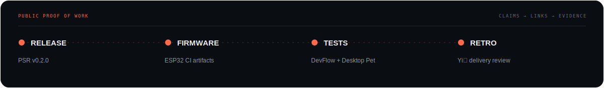

  

 

  <a href="https://rongyishuaige7.github.io/"><strong>个人主页</strong></a>
  &nbsp;·&nbsp;
  <a href="https://github.com/rongyishuaige7/yipan-showcase"><strong>Yi盘</strong></a>
  &nbsp;·&nbsp;
  <a href="#selected-work"><strong>Selected Work</strong></a>
  &nbsp;·&nbsp;
  <a href="#how-i-build"><strong>How I Build</strong></a>

 

## 让 AI 的上下文，跟着人走。

我是 **Rongyi**，**Yi盘创始人**，常驻杭州。

我在构建便携、本地优先、能被真实验证和交付的 **AI Agent 产品、知识系统、桌面工具与软硬件项目**。比起功能数量，我更在意真实状态、明确边界、失败后的恢复，以及产品能否进入真实工作。

> **Make AI context move with you.**
> Portable context · Local-first systems · Products built for real work.

 

### 当前事实边界

- **阶段** · 受控内测 / 上市工程门禁收口
- **验证** · Linux 当前证据最完整；Windows 与 macOS 仍在继续真机验证
- **架构** · 长期资料与治理层尽量保存在本地受管目录；模型推理主要来自云端
- **公开范围** · [`yipan-showcase`](https://github.com/rongyishuaige7/yipan-showcase) 是产品展示与事实说明，不包含商业核心实现、客户配置或制盘工具

> 上图是抽象能力图，不是产品截图。真实产品截图将在完成素材整理后补充。

 

## Selected Work

<table>
  <tr>
    <td width="50%" valign="top">
      <h3><a href="https://github.com/rongyishuaige7/problem-solution-recorder-oss">Problem Solution Recorder</a></h3>
      
面向 AI 工具的 Markdown 问题解决记忆：保留排障证据、维护人类与 AI 双索引，并沉淀可复用模式。

      
<code>Agent Skill</code> <code>Markdown</code> <code>Shell</code>

      
<strong>v0.2.0 · MIT · CI verified</strong>

    </td>
    <td width="50%" valign="top">
      <h3><a href="https://github.com/rongyishuaige7/devflow-recorder">DevFlow Recorder</a></h3>
      
面向 Linux 开发者的本地优先活动记录器，把 Wayland 窗口焦点变化整理成可回顾时间线。

      
<code>Rust</code> <code>Tauri</code> <code>React</code> <code>SQLite</code>

      
<strong>GNOME Wayland MVP · MIT · CI verified</strong>

    </td>
  </tr>
  <tr>
    <td width="50%" valign="top">
      <h3><a href="https://github.com/rongyishuaige7/ESP32_RPS_Game">ESP32 RPS Game</a></h3>
      
基于 ESP32-S3 的视觉猜拳游戏：摄像头启发式识别、OLED、音频、RGB 反馈与可选 MJPEG 推流。

      
<code>C++</code> <code>PlatformIO</code> <code>ESP32-S3</code> <code>OV3660</code>

      
<strong>Firmware CI · MIT · Artifact workflow</strong>

    </td>
    <td width="50%" valign="top">
      <h3><a href="https://github.com/rongyishuaige7/pet-desktop-tauri">Desktop Pet</a></h3>
      
Linux 桌面宠物原型：React 管理界面配合 Rust + GTK 原生透明置顶窗口与本地动作帧。

      
<code>Tauri</code> <code>React</code> <code>Rust</code> <code>GTK</code>

      
<strong>Linux prototype · MIT · CI verified</strong>

    </td>
  </tr>
</table>

“CI verified” 只表示最近核验时配置的测试或构建通过，不等同于所有目标设备、桌面环境或操作系统均已真机验收。

  

## How I Build

| | 原则 | 我如何落实 |
|:--:|---|---|
| `01` | **真实状态，不做假按钮** | 状态、统计与操作结果来自真实文件、索引、进程或 API。 |
| `02` | **先验证，再发布** | 代码完成只是中间状态；CI、产物、目标环境和失败路径都需要证据。 |
| `03` | **本地优先，不虚构离线智能** | 资料与治理层尽量留在本地；模型、网络与凭据边界明确说明。 |
| `04` | **先确认，再沉淀** | 进入 Inbox 不等于长期记忆，用户保留确认、撤回与删除权。 |
| `05` | **轻量、可靠、低售后负担** | 不把内部复杂度转嫁给用户；失败应该可解释、可恢复。 |

 

### Recent Proof of Work

- [`Problem Solution Recorder v0.2.0`](https://github.com/rongyishuaige7/problem-solution-recorder-oss/releases/tag/v0.2.0) — 索引保护、Markdown 转义与知识库密钥扫描
- [`ESP32 firmware workflow`](https://github.com/rongyishuaige7/ESP32_RPS_Game/actions) — 固定依赖并由 CI 生成固件 Artifact
- [`DevFlow Recorder CI`](https://github.com/rongyishuaige7/devflow-recorder/actions) / [`Desktop Pet CI`](https://github.com/rongyishuaige7/pet-desktop-tauri/actions) — 最小业务单元测试与构建验证
- [`Yi盘开发复盘`](https://github.com/rongyishuaige7/yipan-showcase/blob/main/docs/%E5%BC%80%E5%8F%91%E5%A4%8D%E7%9B%98-%E4%BB%8E%E5%8A%9F%E8%83%BD%E9%9B%86%E5%90%88%E5%88%B0%E5%8F%AF%E4%BA%A4%E4%BB%98%E4%BA%A7%E5%93%81.md) — 从功能集合走向可交付产品

 

  <strong>Rongyi · Founder of Yi盘 · Hangzhou</strong>
    
  <a href="https://rongyishuaige7.github.io/">Founder Lab</a>
  &nbsp;·&nbsp;
  <a href="https://github.com/rongyishuaige7?tab=repositories">Repositories</a>
  &nbsp;·&nbsp;
  <a href="https://github.com/rongyishuaige7/yipan-showcase/issues">Yi盘 Feedback</a>
    
  Built with a bias for clarity, evidence, and useful work.

