<picture>
  <source media="(prefers-color-scheme: dark)" srcset="./assets/hero-dark.svg">
  <source media="(prefers-color-scheme: light)" srcset="./assets/hero-light.svg">
  
</picture>

  <strong>Yi盘创始人 | 杭州 | 产品与开源工具</strong>
    
  <a href="https://github.com/rongyishuaige7/yipan-showcase"><strong>了解 Yi盘</strong></a>
  &nbsp;&nbsp;
  <a href="https://rongyishuaige7.github.io/#log"><strong>开发记录</strong></a>

我是 **Rongyi**，在杭州做 **Yi盘**。它是一套装在 U 盘里的随身 AI 工作台。除此之外，我也在做桌面工具和硬件实验。

---

## `// FLAGSHIP PRODUCT`

<picture>
  <source media="(prefers-color-scheme: dark)" srcset="./assets/yipan-flow-dark.svg">
  <source media="(prefers-color-scheme: light)" srcset="./assets/yipan-flow-light.svg">
  
</picture>

**Yi盘是一套装在 U 盘里的随身 AI 工作台。** 长期资料、任务记录和主要产出保存在盘内；需要智能处理时，主要调用云端模型。

| 当前状态 | 平台验证 | 公开范围 |
|:--|:--|:--|
| 受控内测，正在完成上市前验证 | Linux 测试最完整；Windows 和 macOS 继续真机测试 | 产品事实、已知限制和开发复盘公开；核心实现、客户配置与制盘工具不公开 |

> 结构示意，不是产品截图。最后核对：**2026-07-15**。

  <a href="https://github.com/rongyishuaige7/yipan-showcase/blob/main/docs/%E4%BA%A7%E5%93%81%E4%BA%8B%E5%AE%9E%E4%B8%8E%E9%99%90%E5%88%B6.md"><strong>产品事实与限制</strong></a>
  &nbsp;&nbsp;
  <a href="https://github.com/rongyishuaige7/yipan-showcase/issues"><strong>提交 Yi盘反馈</strong></a>

---

## `// OPEN LAB`

<table>
  <tr>
    <td width="50%" valign="top">
      <code>RECORD</code>
      <h3><a href="https://github.com/rongyishuaige7/problem-solution-recorder-oss">Problem Solution Recorder</a></h3>
      
把排障过程保存成可检索的 Markdown，同时生成人读索引和 AI 索引。

      
<code>Agent Skill</code> <code>Markdown</code> <code>Shell</code>

      
<a href="https://github.com/rongyishuaige7/problem-solution-recorder-oss/releases/tag/v0.2.0"><strong>v0.2.0 正式发布</strong></a> <a href="https://github.com/rongyishuaige7/problem-solution-recorder-oss/actions/runs/29339468636">Skill 验证通过</a> | MIT

    </td>
    <td width="50%" valign="top">
      <code>OBSERVE</code>
      <h3><a href="https://github.com/rongyishuaige7/devflow-recorder">DevFlow Recorder</a></h3>
      
在 GNOME Wayland 上记录窗口焦点变化，形成保存在本机的工作时间线。

      
<code>Rust</code> <code>Tauri</code> <code>React</code> <code>SQLite</code>

      
<a href="https://github.com/rongyishuaige7/devflow-recorder/actions/runs/29339471902">Web 单元测试与前端构建通过</a> GNOME Wayland MVP | MIT

    </td>
  </tr>
  <tr>
    <td width="50%" valign="top">
      <code>EMBED</code>
      <h3><a href="https://github.com/rongyishuaige7/ESP32_RPS_Game">ESP32 RPS Game</a></h3>
      
基于 ESP32-S3 的视觉猜拳硬件实验，包含摄像头识别、OLED、音频与 RGB 反馈。

      
<code>C++</code> <code>PlatformIO</code> <code>ESP32-S3</code> <code>OV3660</code>

      
<a href="https://github.com/rongyishuaige7/ESP32_RPS_Game/actions/runs/29339478819">固件构建与 Artifact 上传通过</a> MIT

    </td>
    <td width="50%" valign="top">
      <code>INTERACT</code>
      <h3><a href="https://github.com/rongyishuaige7/pet-desktop-tauri">Desktop Pet</a></h3>
      
使用 Tauri、React、Rust 与 GTK 构建的 Linux 原生透明桌面宠物原型。

      
<code>Tauri</code> <code>React</code> <code>Rust</code> <code>GTK</code>

      
<a href="https://github.com/rongyishuaige7/pet-desktop-tauri/actions/runs/29339475309">Web 单元测试与前端构建通过</a> Linux prototype | MIT

    </td>
  </tr>
</table>

> **CI 范围核对：2026-07-15。** DevFlow 和 Desktop Pet 只检查 Web 单元测试与前端构建；ESP32 只检查固件能否按固定配置编译。Actions 中的固件 Artifact 会过期。

<b><code>// LAB NOTES</code></b> 查看更多开发记录

 

个人主页保留了 Yi盘开发复盘、开源项目发布记录和阶段性测试记录：[`rongyishuaige7.github.io/#log`](https://rongyishuaige7.github.io/#log)。

旧实验项目继续保留在仓库列表中，但不作为当前代表项目展示。

---

  <strong>Rongyi / Yi盘 / Hangzhou</strong>
    
  <a href="https://github.com/rongyishuaige7?tab=repositories">全部仓库</a>

