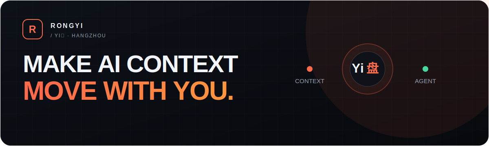
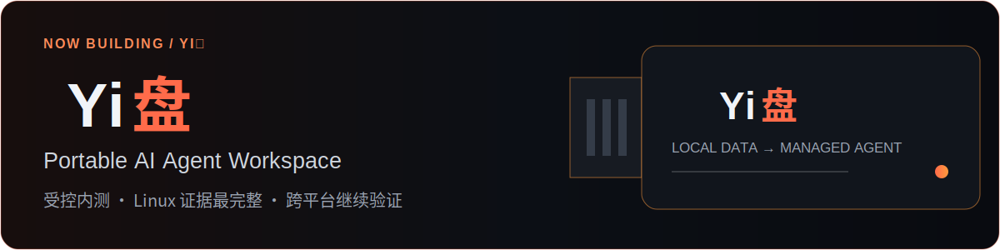

# Rongyi / Founder Lab

  

  <a href="https://rongyishuaige7.github.io/"><strong>个人主页</strong></a>
  &nbsp;·&nbsp;
  <a href="https://github.com/rongyishuaige7/yipan-showcase"><strong>Yi盘</strong></a>

## 让 AI 的上下文，跟着人走。

我是 **Rongyi**，**Yi盘创始人**，常驻杭州。我正在构建便携、本地优先、可被验证和交付的 AI Agent 产品与开发者工具。

> **Make AI context move with you.**

## Now Building / Yi盘

Yi盘是便携式 AI Agent 工作台。长期资料与治理层尽量保存在本地受管目录，模型推理主要来自云端。

- **阶段** · 受控内测 / 上市工程门禁收口
- **验证** · Linux 当前证据最完整；Windows 与 macOS 仍在继续真机验证
- **公开范围** · [`yipan-showcase`](https://github.com/rongyishuaige7/yipan-showcase) 提供可公开检查的产品事实、限制、路线图与开发复盘，不包含商业核心实现、客户配置或制盘工具

> 上图是抽象能力图，不是产品截图。公开状态核验于 **2026-07-15**；最新状态以 [`Yi盘产品事实与限制`](https://github.com/rongyishuaige7/yipan-showcase/blob/main/docs/%E4%BA%A7%E5%93%81%E4%BA%8B%E5%AE%9E%E4%B8%8E%E9%99%90%E5%88%B6.md) 为准。

## Selected Work

### [Problem Solution Recorder](https://github.com/rongyishuaige7/problem-solution-recorder-oss)

面向 AI 工具的 Markdown 问题解决记忆：保留排障证据、维护人类与 AI 双索引，并沉淀可复用模式。

`Agent Skill` `Markdown` `Shell` · **[v0.2.0 正式发布](https://github.com/rongyishuaige7/problem-solution-recorder-oss/releases/tag/v0.2.0)** · **[Skill 验证通过](https://github.com/rongyishuaige7/problem-solution-recorder-oss/actions/runs/29339468636)** · MIT

### [DevFlow Recorder](https://github.com/rongyishuaige7/devflow-recorder)

面向 Linux 开发者的本地优先活动记录器，把 Wayland 窗口焦点变化整理成可回顾时间线。

`Rust` `Tauri` `React` `SQLite` · **[Web 单元测试与前端构建通过](https://github.com/rongyishuaige7/devflow-recorder/actions/runs/29339471902)** · GNOME Wayland MVP · MIT

### [ESP32 RPS Game](https://github.com/rongyishuaige7/ESP32_RPS_Game)

基于 ESP32-S3 的视觉猜拳游戏：摄像头启发式识别、OLED、音频、RGB 反馈与可选 MJPEG 推流。

`C++` `PlatformIO` `ESP32-S3` `OV3660` · **[固件构建与 Artifact 上传通过](https://github.com/rongyishuaige7/ESP32_RPS_Game/actions/runs/29339478819)** · MIT

### [Desktop Pet](https://github.com/rongyishuaige7/pet-desktop-tauri)

Linux 桌面宠物原型：React 管理界面配合 Rust + GTK 原生透明置顶窗口与本地动作帧。

`Tauri` `React` `Rust` `GTK` · **[Web 单元测试与前端构建通过](https://github.com/rongyishuaige7/pet-desktop-tauri/actions/runs/29339475309)** · Linux prototype · MIT

> **证据口径 · 2026-07-15**：上述链接锁定已核验的具体 Release 或 GitHub Actions run。DevFlow 与 Desktop Pet 仅覆盖 Web 单元测试及 TypeScript/Vite 构建，不代表 Rust/Tauri/GTK 原生链路或所有目标环境已验收。ESP32 CI 证明锁定配置可构建，Actions Artifact 具有保留期，不是长期发布下载。

## Build Principles

- **真实状态** · 状态、统计与操作结果来自真实文件、索引、进程或 API。
- **先验证，再发布** · 代码完成只是中间状态；CI、产物、目标环境和失败路径都需要证据。
- **本地优先** · 不虚构离线智能；模型、网络与凭据边界明确说明。
- **先确认，再沉淀** · 进入 Inbox 不等于长期记忆，用户保留确认、撤回与删除权。
- **轻量、可靠** · 不把内部复杂度转嫁给用户；失败应该可解释、可恢复。

更完整的产品与开发记录放在 [Founder Lab](https://rongyishuaige7.github.io/#log)；这份 README 仅保留身份、当前主线和可直接检查的证据。

---

  <strong>Rongyi · Founder of Yi盘 · Hangzhou</strong>
   
  <a href="https://rongyishuaige7.github.io/">Founder Lab</a>
  &nbsp;·&nbsp;
  <a href="https://github.com/rongyishuaige7?tab=repositories">Repositories</a>
  &nbsp;·&nbsp;
  <a href="https://github.com/rongyishuaige7/yipan-showcase/issues">Yi盘 Feedback</a>

